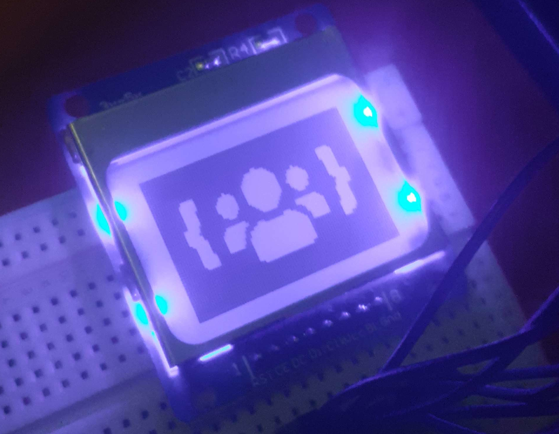

# PCD8544 Java Driver

This is a Java port of [Adafruit PCD8544 Nokia 5110 LCD Library](https://github.com/adafruit/Adafruit-PCD8544-Nokia-5110-LCD-library) designed to work on Raspberry Pi with [pi4j](http://www.pi4j.com/).  
It also has a few enhancements compared to the original library.

## Features

- Support for both software and hardware SPI
- `Graphics2D` compatible API (via [GraphicsWrapper.java](src/main/java/io/github/defective4/pi/pcd8544/GraphicsWrapper.java))
- Support for two-dimensional bitmaps - no need to use external tools to draw images
- Smart drawing - don't redraw parts of screen that were not updated (only when using 2D buffers and `GraphicsWrapper`)

## Installation

*Soon*

## Examples

*Soon*
